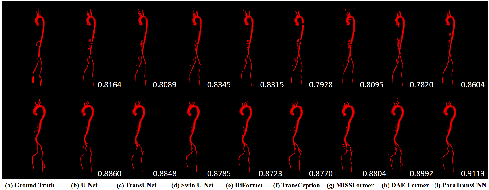

# ParaTransCNN
This repo holds code for [ParaTransCNN: Parallelized TransCNN Encoder for Medical Image Segmentation](https://arxiv.org/abs/2401.15307)
* Overview


## Requirements
We trained on NVIDIA RTX 3090, where python 3.9.10 and torch 1.12.1 on ubuntu 22.04.

We use the libraries of these versions:
* Python 3.9.10
* Torch 1.12.1+cu113
* torchvision 0.13.1+cu113
* numpy 1.21.5

You can pip the same experimental environment as us through requirements
```bash
pip install -r requirements.txt
```

## Dataset preparation
* Synapse Dataset: please go to "./datasets/README.md" for the details about preparing preprocessed Synapse dataset or download the Synapse Dataset from [here](https://drive.google.com/drive/folders/1ACJEoTp-uqfFJ73qS3eUObQh52nGuzCd?usp=sharing).
* AVT Dataset: please go to "./datasets/README.md" for the details about preparing preprocessed AVT dataset. The preprocessed dataset will be exposed later.

## Train
* Run the following code to train ParaTransCNN on the Synapse Dataset:
```bash
python train.py --dataset Synapse --train_path <your path to Synapse train dataset> --model_name ParaTransCNN --max_epochs 150 --batch_size 4 --base_lr 0.01 
```
* Run the following code to train ParaTransCNN on the AVT Dataset:
```bash
python train.py --dataset AVT --train_path <your path to AVT train dataset> --model_name ParaTransCNN --max_epochs 150 --batch_size 4 --base_lr 0.01 
```
## Test
* Run the following code to test the trained ParaTransCNN on the Synapse Dataset:
```bash
python test.py --dataset Synapse --volume_path <your path to Synapse test dataset> --model_name ParaTransCNN --max_epochs 150 --batch_size 4 --base_lr 0.01 
```
* Run the following code to test the trained ParaTransCNN on the AVT Dataset:
```bash
python test.py --dataset AVT --volume_path <your path to AVT test dataset> --model_name ParaTransCNN --max_epochs 150 --batch_size 4 --base_lr 0.01 
```
## Results
* Synapse
### Evaluation metrics

| <h3 align="left">**Methods** </h3> | <p>DSC(%)</p> | <p>HD</p> | <p>Aorta</p> | <p>Gallbladder</p> | <p>Kidney(L)</p> | <p>Kidney(R)</p> | <p>Liver</p> | <p>Pancreas</p> | <p>Spleen</p> | <p>Stomach</p> |
| ---------------------------------- |:----------:|:---------:|:------------:|:------------------:|:----------------:|:----------------:|:------------:|:---------------:|:-------------:|:--------------:|
| DARR                               | 69.77      | -         | 74.74        | 53.77              | 72.31            | 73.24            | 94.08        | 54.18           | 89.90         | 45.96          |
| R50 U-Net                          | 74.68      | 36.87     | 87.74        | 63.66              | 80.60            | 78.19            | 93.74        | 56.90           | 85.87         | 74.16          |
| U-Net                              | 76.85      | 39.70     | 89.07        | 69.72              | 77.77            | 68.60            | 93.43        | 53.98           | 86.67         | 75.58          |
| R50 Att-UNet                       | 75.57      | 36.97     | 55.92        | 63.91              | 79.20            | 72.71            | 93.56        | 49.37           | 87.19         | 74.95          |
| Att-UNet                           | 77.77      | 36.02     | **89.55**    | 68.88              | 77.98            | 71.11            | 93.57        | 58.04           | 87.30         | 75.75          |
| R50 ViT                            | 71.29      | 32.87     | 73.73        | 55.13              | 75.80            | 72.20            | 91.51        | 45.99           | 81.99         | 73.95          |
| TransUnet                          | 77.48      | 31.69     | 87.23        | 63.13              | 81.87            | 77.02            | 94.08        | 55.86           | 85.08         | 75.62          |
| SwinUnet                           | 79.13      | 21.55     | 85.47        | 66.53              | 83.28            | 79.61            | 94.29        | 56.58           | 90.66         | 76.60          |
| TransDeepLab                       | 80.16      | 21.25     | 86.04        | 69.16              | 84.08            | 79.88            | 93.53        | 61.19           | 89.00         | 78.40          |
| HiFormer                           | 80.39      | **14.70** | 86.21        | 65.69              | 85.23            | 79.77            | 94.61        | 59.52           | 90.99         | 81.08          |
| MISSFormer                         | 81.96      | 18.20     | 86.99        | 68.65              | 85.21            | 82.00            | 94.41        | 65.67           | 91.92         | 80.81          |
| TransCeption                       | 82.24      | 20.89     | 87.60        | 71.82              | 86.23            | 80.29            | **95.01**    | 65.27           | 91.68         | 80.02          |
| DAE-Former                         | 82.43      | 17.46     | 88.96        | **72.30**          | 86.08            | 80.88            | 94.98        | 65.12           | 91.94         | 79.19          |
| ParaTransCNN                              | **83.86**  | 15.86     | 88.12        | 68.97              | **87.99**        | **83.84**        | **95.01**    | **69.79**     |**92.71**      | **84.43**  |

### Visualization on Synapse


* AVT
### Visualization on AVT


* ACDC
### Visualization on ACDC


* Kvasir_SEG
### Evaluation metrics

| <h3 align="left">**Methods** </h3> | <p>Dice</p> | <p>Jaccard</p> | <p>Precision</p> | <p>Recall </p> | 
| ---------------------------------- |:----------:|:---------:|:------------:|:------------------:|
| U-Net                              | 0.830530      | 0.748300     | 0.860328       | 0.858857              | 
| UNet++                             | 0.795231      | 0.705255     | 0.825769       | 0.840401              | 
| Att-UNet                           | 0.828564      | 0.748071     | 0.848016       | 0.863609              | 
| TransUnet                          | 0.869120      | 0.799637     | 0.895035       | 0.886673              |
| SwinUnet                           | 0.854450      | 0.777262     | 0.890461       | 0.862594              |
| TransDeepLab                       | 0.859171      | 0.779644     | 0.881949       | 0.883266              |
| HiFormer                           | 0.859615      | 0.786705     | 0.879861       | 0.884120              |
| MISSFormer                         | 0.715535      | 0.611769     | 0.760764       | 0.765871              | 
| TransCeption                       | 0.773330      | 0.676522     | 0.801368       | 0.813837              |
| DAE-Former                         | 0.779659      | 0.680100     | 0.806010       | 0.807978              |
| ParaTransCNN                       | **0.882230**  | **0.819137**     | **0.895940**       | **0.900321**  |

### Visualization on Kvasir_SEG


* BUSI(benign & malignant)
### Evaluation metrics

| <h3 align="left">**Methods** </h3> | <p>Dice</p> | <p>Jaccard</p> | <p>Precision</p> | <p>Recall </p> | 
| ---------------------------------- |:----------:|:---------:|:------------:|:------------------:|
| U-Net                              | 0.779577      | 0.698415     | 0.795101       | 0.811817              | 
| UNet++                             | 0.751396      | 0.665028     | 0.774793       | 0.780807              | 
| Att-UNet                           | 0.784430      | 0.701824     | 0.820558       | 0.792074              | 
| TransUnet                          | 0.791364      | 0.711470     | 0.810834       | **0.822213**              |
| SwinUnet                           | 0.781966      | 0.694188     | 0.822793       | 0.782219              |
| TransDeepLab                       | 0.778597      | 0.693664     | 0.799186       | 0.791463              |
| HiFormer                           | 0.779438      | 0.699652     | 0.795937       | 0.803998              |
| MISSFormer                         | 0.731416      | 0.633783     | 0.766812       | 0.754716              | 
| TransCeption                       | 0.758622      | 0.660874     | 0.803228       | 0.765918              |
| DAE-Former                         | 0.733205      | 0.634020     | 0.775104       | 0.745468              |
| ParaTransCNN                       | **0.809358**  | **0.729952**     | **0.850570**       | 0.804386  |

### Visualization on BUSI


## Reference
* [TransUNet](https://arxiv.org/abs/2102.04306)
* [ResNet](https://arxiv.org/abs/1512.03385)
